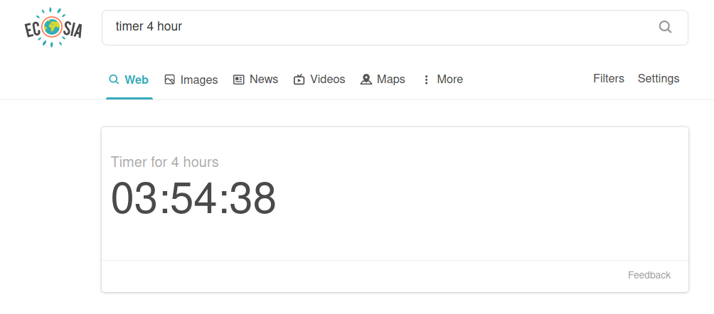

## ecosia-password-gen
**Plant trees... securely :D**

### About
This is an implementation of my [Ecosia extension tool](https://github.com/nbennett320/ecosia-widget-react) -- it adds a password generation feature to Ecosia, obviously inspired by [DuckDuckGo's password generation feature](https://duckduckgo.com/?q=password+strong+12&ia=answer) _[(more info)](https://help.duckduckgo.com/duckduckgo-help-pages/features/instant-answers-and-other-features/)_.
The idea is that cool new features like this one will help reel in new users to Ecosia, and new Ecosia users === more trees planted 🌳💞. 


### Installation
```
# clone the repo
$ git clone git@github.com:nbennett320/ecosia-password-gen.git

# not sure what does but it seems to work
$ cd ecosia-password-gen/

# install dependencies with yarn
$ yarn install
```

### Usage
```
# open a development window in firefox 
$ yarn run start:firefox

# open a development window in (🤢) chrome 
$ yarn run start:chrome

# build files to './extension'
$ yarn run build

# compress build folder to {manifest.name}.zip and crx
$ npm run build
$ npm run compress -- [options]
```

More info and details can be found on [kryptokinght's repo](https://github.com/kryptokinght/react-extension-boilerplate).